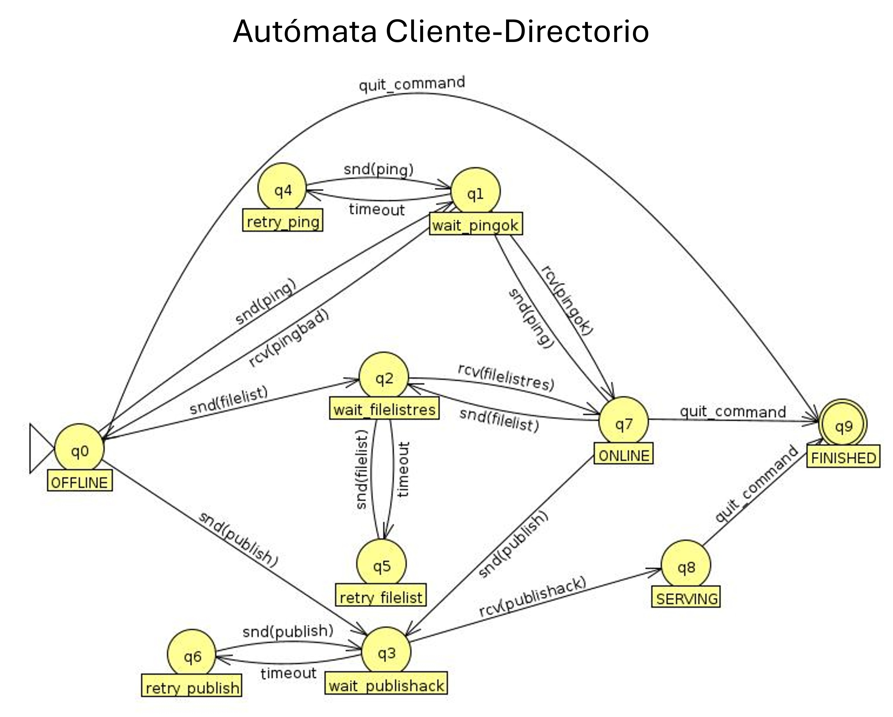
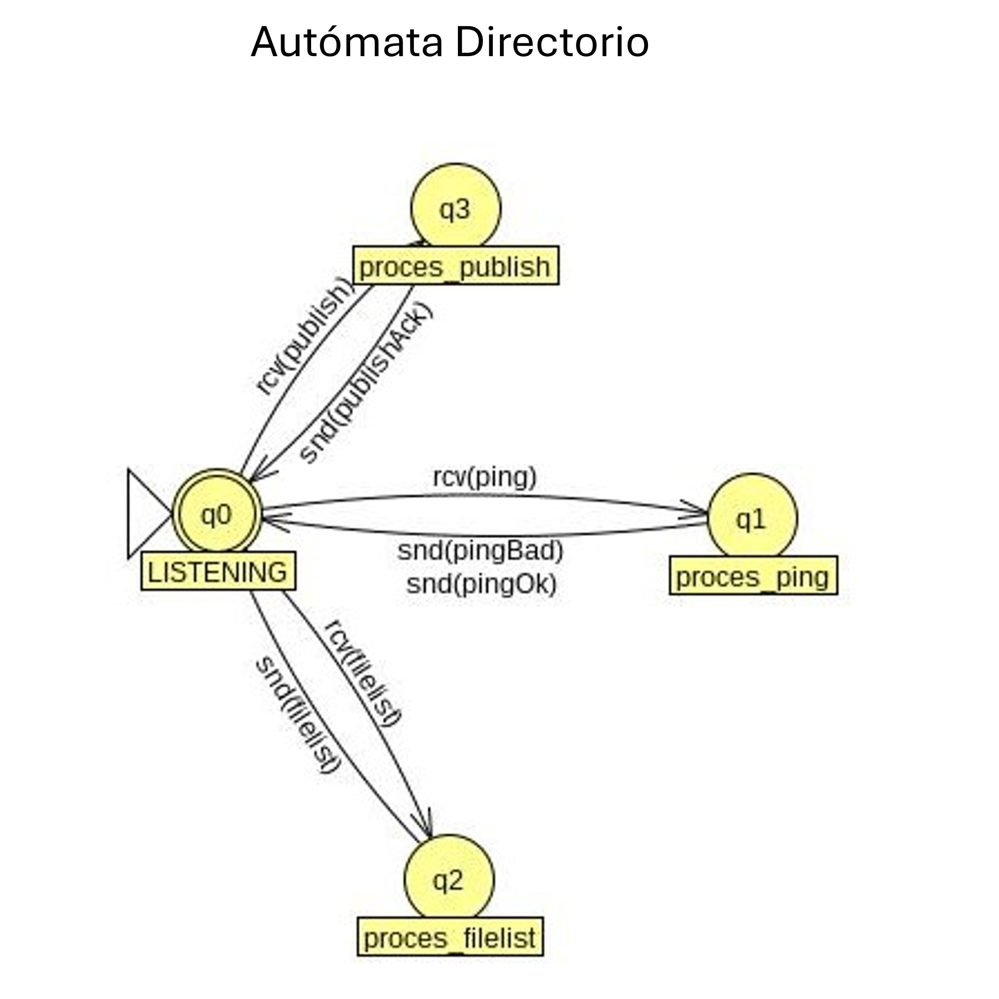
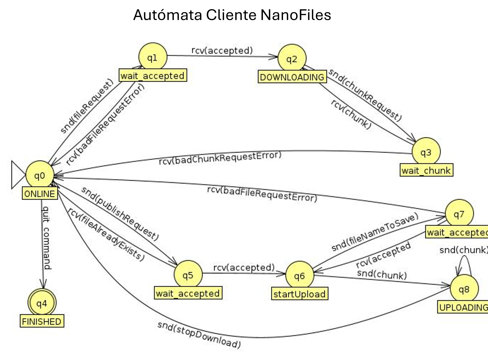

---
output:
  pdf_document: default
  html_document: default
---

# nanofiles-c protocol specification

Revision B

### Notation

 - asdf: static data
 - \< >: mandatory field
 - \[ ]: optional field
 - \[...]: last object N times
 - All sizes are in bytes

## Directory protocol

UTF-8 encoded text/plain in key:value format over simple UDP. Whitespaces are stripped.

### Client requests

#### Ping request

Test the connection and compatibility

 - Operation `ping`
 - Fields
   - `protocol id`
 - Answer 'ping reply'

```
operation: ping
protocol: <protocol id>

```

#### Filelist request

Get file information known by directory

 - Operation `filelist`
 - Fields: None
 - Answer 'filelist reply'

```
operation: filelist

```

#### Peerlist request

Get the peers that serve this file known by the directory

 - Operation `peerlist`
 - Fields:
 	- File hash
 - Answer 'peerlist reply'
 
```
operation: peerlist
reqfile: <hash>

```

#### Publish request

Inform directory of list available files for download from client

 - Operation `publish`
 - Fields: (see below), the list can be empty
 - Answer 'publish response'

```
operation: publish
[port: <port>]
file: <hash1>; <filename1>; <size1>
file: <hash2>; <filename2>; <size2>
[...]

```

### Directory responses

#### Ping reply

Acknoledges back connection and informs client of compatibility

 - Operation `pingok`
 - Fields: None
 - Answer to 'ping request'

```
operation: pingok

```

#### Ping bad reply

Warns the client its using the wrong protocol

 - Operation `pingbad`
 - Fields: None
 - Answer to 'ping request'

```
operation: pingbad

```

#### Filelist reply

Send back list of known (filename, hash, size and peers) for every file known

 - Operation `filelistres`
 - Fields: (see below), the list can be empty
 - Answer to 'filelist request'

```
operation: filelistres
file: <hash1>; <filename1>; <size1>
file: <hash2>; <filename2>; <size2>
[...]

```

#### Peerlist reply

Send back known peers that serve the file

 - Operation `peerlistres`
 - Fields: (see below), the list can be empty
 - Answer 'peerlist reply'
 
```
operation: peerlistres
peer: <hostname1[:port]>
peer: <hostname2[:port]>

```

#### Peerlist bad reply

The hash in `reqfile` is of any file known by directory

 - Operation `peerlistbad`
 - Fields: None
 - Answer to 'peerlist request'
 
```
operation: peerlistbad

```

#### Publish reply

Acknowledge publish request

 - Operation `publishack`
 - Fields: None
 - Answer to: 'publish request'

```
operation: publishack

```

## Peer protocol

Binary little-endian over TCP buffers

All messages begin with an opcode byte

### Client requests

Opcode in 0x0X

#### File request

Requests availability of file to be downloaded

 - Opcode: 0x01
 - Fields: 
   - hash[20]: Filename's hash
 - Answer: 'accepted' or 'file not found error'

```
0        1        3        4        5		  byte
+--------+
| opcode |
+-------------------------------------------+
| hash                                      |
|                                           |
|                                           |
|                                           |
+-------------------------------------------+

```

#### Chunk request

Asks server to send a chunk

 - Opcode: 0x02
 - Fields: 
   - offset[8]: Starting byte of chunk
   - size[4]: Size of chunk
 - Answer: 'chunk'

```
0        1       2       3       4       5       6       7       8         byte
+--------+----------------------------------------------------------------+
| opcode | offset                                                         |
+--------+----------------------+-----------------------------------------+
| size                          |
+-------------------------------+
```

#### Stop download

Terminates current file request

 - Opcode: 0x03
 - Fields: None
 - Answer: None

```
0               
+--------+
| opcode |
+--------+
```

### Server requests

Opcode in 0x1X

#### Accepted

File is available to download via chunk requests

 - Opcode 0x11
 - Fields: None
 - Answer to: 'file request'

```
0               
+--------+
| opcode |
+--------+
```

#### Bad file request error

File is unavailable or not found

 - Opcode: 0x12
 - Fields: None
 - Answer to: 'file request'

```
0               
+--------+
| opcode |
+--------+
```

#### Chunk

Data chunk of file

 - Opcode: 0x13
 - Fields: 
   - size[4]: Size of chunk
   - data[size]: 
 - Answer to: 'chunk request'

```
0        1       2       3       4       byte
+--------+------------------------------+
| opcode | size                         |
+--------+------------------------------+
| data ...
|
```

#### Bad chunk request error

File is unavailable or not found

 - Opcode: 0x14
 - Fields: None
 - Answer to: 'chunk request'

```
0               
+--------+
| opcode |
+--------+
```

## Application automaton

### Directory protocol

#### Client automaton



#### Server automaton



### Peer protocol

#### Client automaton



#### Server automaton


